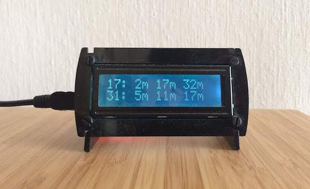

# minitransportsign


Micro python signage 'player' for a 16x2 transit arrival times sign (currently for 
Norwegian transit only)

This project requires:
- A Raspberry Pi or any other computer assigned to the sign
- A 16x2 character display  

NOTE: Relies on the community-made lcdbackpack library, an easier-to-use library of functions for the [i2c/usb adafruit backpack](https://www.adafruit.com/product/782).

## Installation: 

1. Download minitransportsign
2. Install dependencies (listed in requirements.txt)
3. Configure a 16x2 character display via Serial/i2c/USB to a Raspberry Pi
4. Select station ID to point to
5. Run on RPI at boot with an entry at `/etc/rc.local`: 
```
python3 /path/to/signageFunction.py &
```

## TODO:
- [x] migration to entur API (new branch, using this [translation guide](https://rutebanken.atlassian.net/wiki/spaces/PUBLIC/pages/319586310/Migrering+reises+k+API+1.1+-+2.0)
- [ ] Further abstraction for selected lines and directions
- [X] Upgrade to python3
